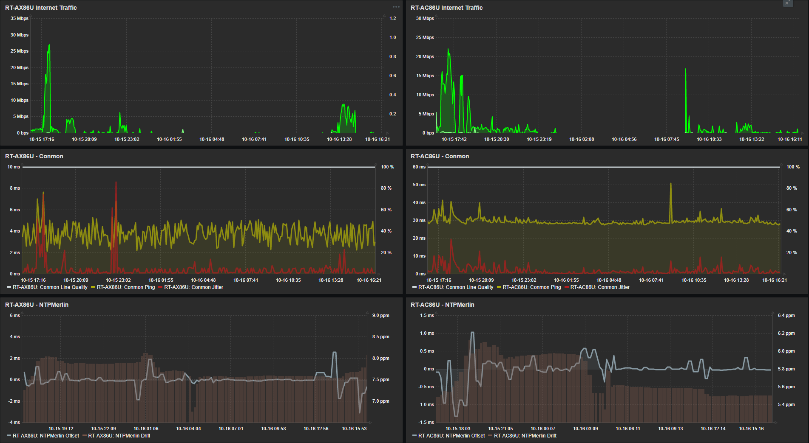

# Zabbix Template for Asus WRT Merlin Routers

<strong>
  If you want to monitor your Asus SOHO router using a Zabbix agent, this template offers some useful monitoring items, triggers, graphs and more.
</strong>
 

If you copy, please mention your source.

 

### REQUIREMENTS
<UL>
  <LI>Asus WRT Router with Merlin firmware</LI>
  <LI>Entware installed</LI>
  <LI>Zabbix agent installed</LI>
    <UL>
      <LI>You can try my <a href=https://github.com/diasdmhub/Zabbix_agent_Asus_Merlin>Zabbix Agent installation script</a></LI>
    </UL>
  <LI>Zabbix agent configuration file</LI>
    <UL>
      <LI>Use <code>Server=</code> parameter with your Zabbix Server IP/Hostname</LI>
      <LI>Add <code>AllowKey=system.run[*]</code> parameter<i> (necessary for custom checks)</i></LI>
      <LI>Add <code>AllowRoot=1</code> parameter<i> (necessary since no Zabbix user is created)</i></LI>
      <small><i><a href=https://www.zabbix.com/forum/zabbix-troubleshooting-and-problems/402023-zabbix-agent-system-run>Zabbix forum discussion</a></i></small>
    </UL>
</UL>
 

### ENABLED
<table>
  <tr>
	<td>Items</td>
  </tr>
  <tr>
	<td>Triggers</td>
  </tr>
  <tr>
	<td>Graphs</td>
  </tr>
  <tr>
	<td>Discovery rules</td>
  </tr>
  <tr>
	<td>WEB scenarios</td>
  </tr>
</table>
 

### LINKED TEMPLATES
<table>
  <tr>
	<td>SSH Service (<i>passive agent only</i>)</td>
  </tr>
  <tr>
	<td>ICMP Ping (<i>passive agent only</i>)</td>
  </tr>
  <tr>
	<td>Linux block devices by Zabbix agent</td>
  </tr>
  <tr>
	<td>Linux filesystems by Zabbix agent</td>
  </tr>
  <tr>
	<td>Linux network interfaces by Zabbix agent</td>
  </tr>
  <tr>
	<td>Linux memory by Zabbix agent</td>
  </tr>
  <tr>
	<td>Zabbix agent</td>
  </tr>
</table>
 

	
### ITEMS

<!--

-->

<table>
  <tr>
	<td>AdGuard Home Status</td>
  </tr>
  <tr>
	<td>Conmon CSV</td>
  </tr>
  <tr>
	<td>Conmon CSV: Conmon Jitter</td>
  </tr>
  <tr>
	<td>Conmon CSV: Conmon Line Quality</td>
  </tr>
  <tr>
	<td>Conmon CSV: Conmon Ping</td>
  <tr>    
	<td>HTTP Performance</td>
  </tr>
  <tr>    
	<td>HTTP Performance Average</td>
  </tr>
  <tr>	
	<td>HTTPS Performance</td>
  </tr>
  <tr>    
	<td>HTTPS Performance Average</td>
  </tr>
  <tr>	
	<td>NTP Performance</td>
  </tr>
  <tr>	
	<td>NTP Performance Average</td>
  </tr>
  <tr>	
	<td>SSH Service: SSH service is running</td>
  </tr>
  <tr>	
	<td>Internet IPv4</td>
  </tr>
  <tr>	
	<td>Internet IPv6</td>
  </tr>
  <tr>    
	<td>Linux memory by Zabbix agent: Available memory</td>
  </tr>
  <tr>	
	<td>Linux memory by Zabbix agent: Available memory in %</td>
  </tr>
  <tr>	
	<td>Linux memory by Zabbix agent: Memory utilization</td>
  </tr>
  <tr>	
	<td>Linux memory by Zabbix agent: Free swap space</td>
  </tr>
  <tr>    
	<td>Linux memory by Zabbix agent: Free swap space in %</td>
  </tr>
  <tr>	
	<td>Linux memory by Zabbix agent: Total memory</td>
  </tr>
  <tr>	
	<td>Linux memory by Zabbix agent: Total swap space</td>
  </tr>
  <tr>	
	<td>Memory WebUI Free</td>
  </tr>
  <tr>	
	<td>Memory WebUI Total</td>
  </tr>
  <tr>	
	<td>Memory WebUI Used</td>
  </tr>
  <tr>	
	<td>NTPMerlin CSV</td>
  </tr>
  <tr>	
	<td>NTPMerlin CSV: NTPMerlin Drift</td>
  </tr>
  <tr>	
	<td>NTPMerlin CSV: NTPMerlin Offset</td>
  </tr>
  <tr>	
	<td>CPU idle time</td>
  </tr>
  <tr>	
	<td>CPU idle time: CPU utilization</td>
  </tr>
  <tr>	
	<td>Number of CPUs</td>
  </tr>
  <tr>	
	<td>Load average (15m avg)</td>
  </tr>
  <tr>	
	<td>Load average (5m avg)</td>
  </tr>
  <tr>	
	<td>Load average (1m avg)</td>
  </tr>
  <tr>	
	<td>Maximum number of processes</td>
  </tr>
  <tr>	
	<td>Number of processes</td>
  </tr>
  <tr>	
	<td>Number of running processes</td>
  </tr>
  <tr>	
	<td>Operating system</td>
  </tr>
  <tr>	
	<td>System boot time</td>
  </tr>
  <tr>	
	<td>System description</td>
  </tr>
  <tr>	
	<td>System local time</td>
  </tr>
  <tr>	
	<td>System name</td>
  </tr>
  <tr>	
	<td>System uptime</td>
  </tr>
  <tr>	
	<td>Temperature CPU</td>
  </tr>
  <tr>	
	<td>Temperature Wireless 2.4GHz</td>
  </tr>
  <tr>	
	<td>Temperature Wireless 5.0GHz</td>
  </tr>
  <tr>	
	<td>Zabbix agent: Host name of Zabbix agent running</td>
  </tr>
  <tr>	
	<td>Zabbix agent: Version of Zabbix agent running</td>
  </tr>
  <tr>	
	<td>Zabbix agent: Zabbix agent ping</td>
  </tr>
  <tr>	
	<td>Zabbix agent: Zabbix agent availability</td>
  </tr>
  <tr>
	<td><i>Network discovery items</i></td>
  </tr>
  <tr>
	<td><i>Mounted filesystem discovery</i></td>
  </tr>
  <tr>
	<td><i>Block devices discovery</i></td>
  </tr>
  <tr>
	<td>ICMP Ping: ICMP loss</td>
  </tr>
  <tr>
	<td>ICMP Ping: ICMP ping</td>
  </tr>
  <tr>
	<td>ICMP Ping: ICMP response time</td>
  </tr>
</table>
 

### TRIGGERS
<table>
  <tr>
	<td>AdGuardHome Status Down</td>
  </tr>
  <tr>
	<td>ALERT CPU High temperature</td>
  </tr>
  <tr>
	<td>Conmon reports low line quality</td>
  </tr>
  <tr>
	<td>CPU High temperature</td>
  </tr>
  <tr>
	<td>Getting closer to process limit (over 80% used)</td>
  </tr>
  <tr>
	<td>High CPU utilization (over % for 5m)</td>
  </tr>
  <tr>
	<td>ICMP Ping: High ICMP ping loss</td>
  </tr>
  <tr>
	<td>ICMP Ping: High ICMP ping response time</td>
  </tr>
  <tr>
	<td>Linux memory by Zabbix agent: High memory utilization (> % for 5m)</td>
  </tr>
  <tr>
	<td>Linux memory by Zabbix agent: High swap space usage (less than % free)</td>
  </tr>
  <tr>
	<td>HTTP service is down</td>
  </tr>
  <tr>
	<td>HTTPS service is down</td>
  </tr>
  <tr>
	<td>Linux memory by Zabbix agent: Lack of available memory</td>
  </tr>
  <tr>
	<td>Load average is too high (per CPU load for 5m)</td>
  </tr>
  <tr>
	<td>NTP service is down</td>
  </tr>
  <tr>
	<td>Operating system description has changed</td>
  </tr>
  <tr>
	<td>SSH Service: SSH service is down</td>
  </tr>
  <tr>
	<td>System name has changed</td>
  </tr>
  <tr>
	<td>System time is out of sync (diff with Zabbix server > s)</td>
  </tr>
  <tr>
	<td>ICMP Ping: Unavailable by ICMP ping</td>
  </tr>
  <tr>
	<td>Wireless 2.4GHz high temperature</td>
  </tr>
  <tr>
	<td>Wireless 5.0Hz high temperature</td>
  </tr>
  <tr>
	<td>Zabbix agent: Zabbix agent is not available (for m)</td>
  </tr>
  <tr>
	<td>HOST has been restarted (uptime < 10m)</td>
  </tr>
</table>
 

### GRAPHS
<table>
  <tr>
	<td>CPU utilization</td>
  </tr>
  <tr>
	<td>Linux memory by Zabbix agent: Memory usage</td>
  </tr>
  <tr>
	<td>Linux memory by Zabbix agent: Memory utilization</td>
  </tr>
  <tr>
	<td>Memory WEBUI</td>
  </tr>
  <tr>
	<td>NTPMerlin</td>
  </tr>
  <tr>
	<td>Processes</td>
  </tr>
  <tr>
	<td>Linux memory by Zabbix agent: Swap usage</td>
  </tr>
  <tr>
	<td>System load</td>
  </tr>
  <tr>
	<td>Temperature</td>
  </tr>
  <tr>
	<td>WEB x NTP Perfomance</td>
  </tr>	
</table>
 

### DISCOVERY RULES
<table>
  <tr>
	<td>Linux network interfaces by Zabbix agent: Network interface discovery</td>
  </tr>
  <tr>
	<td>Linux filesystems by Zabbix agent: Mounted filesystem discovery</td>
  </tr>
  <tr>
	<td>	Linux block devices by Zabbix agent: Block devices discovery</td>
  </tr>
</table>
 

	
### WEB MONITORING
<table>
  <tr>
	<td>HTTPS WEB UI Reply</td>
  </tr>
  <tr>
	<td>HTTP WEB UI Reply</td>
  </tr>
</table>
 
	
	
### GRAPH EXAMPLE

 
<UL>
  <LI><a href=https://www.snbforums.com/threads/gui-memory-x-meminfo.68683/#post-645321>WEB UI Memory discussion</a></LI>
</UL>

 <strong>TESTED AS IS</strong>
<strong><i>
   This template was tested only with Asus RT-AC86U / RT-AC87U / RT-AX86U router running an Asus Merlin firmware.
   It should work with other Asus routers as well.
   Feedbacks are welcome.
</i></strong>
