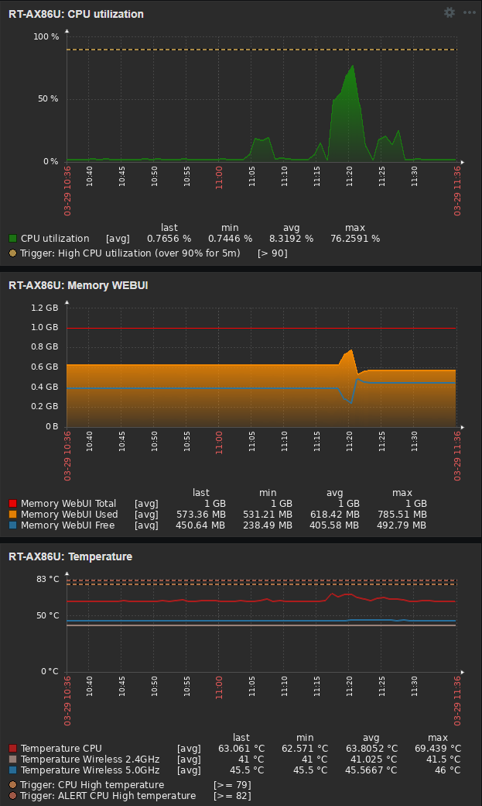

# Zabbix Template for Asus WRT Merlin Routers

<strong>
  If you want to monitor your Asus SOHO router using a Zabbix agent, this template offers some useful monitoring items.
</strong>

  <strong>REQUIREMENTS</strong>

<UL>
  <LI>Asus WRT Router with Merlin firmware</LI>
  <LI>Entware installed</LI>
  <LI>Zabbix agent installed</LI>
    <UL>
      <LI>You can try my <a href=https://github.com/diasdmhub/Zabbix_agent_Asus_Merlin>Zabbix Agent installation script</a></LI>
    </UL>
  <LI>Zabbix agent configuration file</LI>
    <UL>
      <LI>Use <code>Server=</code> with your router's IP/Hostname</LI>
      <LI>Add <code>AllowKey=system.run[*]</code> parameter<i> (necessary for custom checks)</i></LI>
      <LI>Add <code>AllowRoot=1</code> parameter<i> (necessary since no Zabbix user is created)</i></LI>
      <small><i><a href=https://www.zabbix.com/forum/zabbix-troubleshooting-and-problems/402023-zabbix-agent-system-run>Zabbix forum discussion</a></i></small>
    </UL>
</UL>

 <strong>ENABLED</strong>
<UL>
  <LI>Items</LI>
  <LI>Triggers</LI>
  <LI>Graphs</LI>
  <LI>Discovery rules</LI>
  <LI>WEB scenarios</LI>
</UL>

 <strong>LINKED TEMPLATES</strong>
<OL>
  <LI>SSH Service
  <LI>ICMP Ping (<i>passive agent only</i>)
  <LI>Linux block devices by Zabbix agent
  <LI>Linux filesystems by Zabbix agent
  <LI>Linux network interfaces by Zabbix agent
  <LI>Linux memory by Zabbix agent
  <LI>Zabbix agent
</OL>

 <strong>AVALIABLE ITEMS</strong>

<!--

-->

<table>
  <tr>
        <th>Asus Router items</th>
  </tr>
  <tr>
	    <td>Connected clients</td>
	</tr>
  <tr>    
		  <td>DHCP Leases</td>
	</tr>
  <tr>    
		  <td>HTTP Performance</td>
	</tr>
  <tr>    
	  	<td>HTTP Performance Average</td>
	</tr>
  <tr>	
		  <td>HTTPS Performance</td>
	</tr>
  <tr>    
	  	<td>HTTPS Performance Average</td>
	</tr>
  <tr>	
	    <td>NTP Performance</td>
	</tr>
  <tr>	
	    <td>NTP Performance Average</td>
	</tr>
  <tr>	
	    <td>SSH Service: SSH service is running</td>
	</tr>
  <tr>	
	    <td>Internet IPv4</td>
	</tr>
  <tr>	
	    <td>Internet IPv6</td>
	</tr>
  <tr>    
	  	<td>Linux memory by Zabbix agent: Available memory</td>
	</tr>
  <tr>	
	    <td>Linux memory by Zabbix agent: Available memory in %</td>
	</tr>
  <tr>	
	    <td>Linux memory by Zabbix agent: Available memory in %: Memory utilization</td>
	</tr>
  <tr>	
	    <td>Linux memory by Zabbix agent: Free swap space</td>
	</tr>
  <tr>    
	  	<td>Linux memory by Zabbix agent: Free swap space in %</td>
	</tr>
  <tr>	
	    <td>Linux memory by Zabbix agent: Total memory</td>
	</tr>
  <tr>	
	    <td>Linux memory by Zabbix agent: Total swap space</td>
	</tr>
  <tr>	
	    <td>Memory WebUI Free</td>
	</tr>
  <tr>	
	    <td>Total memory: Memory WebUI Total</td>
	</tr>
  <tr>	
	    <td>Memory WebUI Used</td>
	</tr>
  <tr>	
	    <td>CPU idle time</td>
	</tr>
  <tr>	
	    <td>CPU idle time: CPU utilization</td>
	</tr>
  <tr>	
	    <td>Number of CPUs</td>
	</tr>
  <tr>	
	    <td>Load average (15m avg)</td>
	</tr>
  <tr>	
	    <td>Load average (5m avg)</td>
	</tr>
  <tr>	
	    <td>Load average (1m avg)</td>
	</tr>
  <tr>	
	    <td>Maximum number of processes</td>
	</tr>
  <tr>	
	    <td>Number of processes</td>
	</tr>
  <tr>	
	    <td>Number of running processes</td>
	</tr>
  <tr>	
	    <td>Operating system</td>
	</tr>
  <tr>	
	    <td>System boot time</td>
	</tr>
  <tr>	
	    <td>System description</td>
	</tr>
  <tr>	
	    <td>System local time</td>
	</tr>
  <tr>	
	    <td>System name</td>
	</tr>
  <tr>	
	    <td>System uptime</td>
	</tr>
  <tr>	
	    <td>Temperature CPU</td>
	</tr>
  <tr>	
	    <td>Temperature Wireless 2.4GHz</td>
	</tr>
  <tr>	
	    <td>Temperature Wireless 5.0GHz</td>
	</tr>
  <tr>	
	    <td>Zabbix agent: Host name of Zabbix agent running</td>
	</tr>
  <tr>	
	    <td>Zabbix agent: Version of Zabbix agent running</td>
	</tr>
  <tr>	
	    <td>Zabbix agent: Zabbix agent ping</td>
	</tr>
  <tr>	
	    <td>Zabbix agent: Zabbix agent availability</td>
	</tr>
  <tr>
      <td><i>Network discovery items</i></td>
  </tr>
  <tr>
      <td><i>Mounted filesystem discovery</i></td>
  </tr>
  <tr>
      <td><i>Block devices discovery</i></td>
  </tr>
  <tr>
	    <td>ICMP Ping: ICMP loss</td>
	</tr>
  <tr>
		<td>ICMP Ping: ICMP ping</td>
	</tr>
  <tr>
		<td>ICMP Ping: ICMP response time</td>
  </tr>
</table>

 <strong>GRAPH EXAMPLE</strong>
    

 
<UL>
  <LI><a href=https://www.snbforums.com/threads/gui-memory-x-meminfo.68683/#post-645321>WEB UI Memory discussion</a></LI>
</UL>

 <strong>TESTED AS IS</strong>
 
<strong><i>
  This template was tested only with Asus RT-AC86U / RT-AC87U / RT-AX86U router running a Asus Merlin firmware.
  It should work with other Asus routers as well.
  Feedbacks are welcome.
</i></strong>
