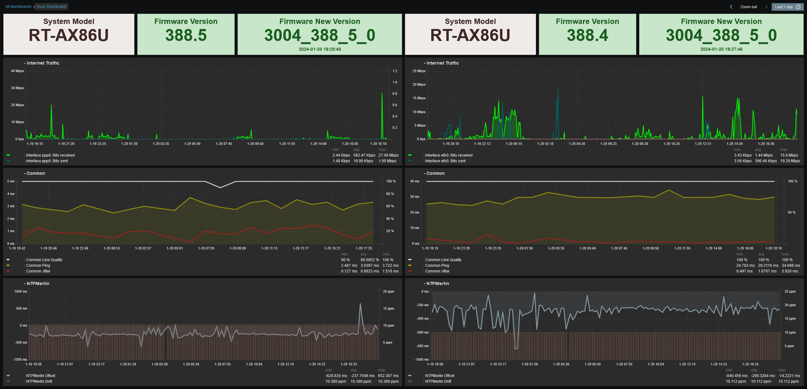

# Zabbix Template for Asus WRT Merlin Routers

	
   
  

 

### OVERVIEW
If you want to monitor your Asus SOHO router with a Zabbix agent, this template provides some useful monitoring items, triggers, graphs and more.
It targets Asus WRT routers with the Merlin firmware installed. \
The release comes with two templates, one for passive Zabbix Agent checks and one for active checks.

The main focus is on monitoring specific Asus WRT Merlin router items.

 

### REQUIREMENTS

- Asus WRT Router with [Merlin firmware](https://www.asuswrt-merlin.net)
- Entware installed
- Zabbix agent installed
  - _You can try my [Zabbix Agent installation script](https://github.com/diasdmhub/Zabbix_agent_Asus_Merlin)_

 

### SETUP

- Configure the Zabbix Agent configuration file:
  - Use `Server=` parameter with your Zabbix Server IP/Hostname
  - Add `AllowKey=system.run[*]` parameter *(necessary for custom checks)*
  - Add `AllowRoot=1` parameter *(necessary since no Zabbix user is created)* \
  [*Zabbix forum discussion*](https://www.zabbix.com/forum/zabbix-troubleshooting-and-problems/402023-zabbix-agent-system-run)

 

---
### ➡️ [Download (latest)](https://github.com/diasdmhub/Asus_Merlin_Zabbix_Template/releases)
---
#### ➡️ [*How to import templates*](https://www.zabbix.com/documentation/current/en/manual/xml_export_import/templates#importing)
> _**For general Linux items, it is recommended to link your host to the official Linux template, which provides several items for monitoring, including CPU, memory, disk and bandwidth information.**_
---

 

### TESTED VERSION
- This template has only been tested with Asus RT-AC86U / RT-AC87U / RT-AX86U routers running an Asus Merlin firmware.
- It should also work with other Asus routers.
- [*SNBForums original post*](https://www.snbforums.com/threads/asus-merlin-router-with-zabbix-agent.64343)
- [*WEB UI Memory discussion*](https://www.snbforums.com/threads/gui-memory-x-meminfo.68683/#post-645321)

 

### MACROS USED

| Name                   | Default Value   | Description |
| ---------------------- | --------------- | ----------- |
| {$CONMON.QUALITY.WARN} | `90`            | Warn value in % for Conmon Line Quality trigger |
| {$CPU.HIGH.TEMP}       | `79`            | High temperature threshold in °C |
| {$CPU.TOP.TEMP}        | `82`            | Higher temperature threshold in °C |
| {$DNSNAME}             |                 | Desired domain name to query with "net.dns" key |
| {$IF.INTERNET}         | `ppp0`          | Internet connected interface. Change at host level if it is different for your device |
| {$IF.WLTEMP2}          | `eth5`          | 2.4GHz wireless interface for temperature sensor. Check your router's interface |
| {$IF.WLTEMP5}          | `eth6`          | 5GHz wireless interface for temperature sensor. Check your router's interface |
| {$WEB.PORT}            | `80`            | Define here your host HTTP/HTTPS port |
| {$WEB.PROTOCOL}        | `http`          | Web protocol, HTTP or HTTPS, to monitor by TCP |

 

### ITEMS

| Name                             |
| -------------------------------- |
| AdGuard Home Status              |
| Conmon CSV                       |
| Conmon CSV: Conmon Jitter        |
| Conmon CSV: Conmon Line Quality  |
| Conmon CSV: Conmon Ping          |
| DNS Service IPv4                 |
| DNS Service IPv6                 |
| Device Model                     |
| Internet IPv4                    |
| Internet IPv6                    |
| Memory WebUI Free                |
| Memory WebUI Total               |
| Memory WebUI Used                |
| NTP Performance                  |
| NTPMerlin CSV                    |
| NTPMerlin CSV: NTPMerlin Drift   |
| NTPMerlin CSV: NTPMerlin Offset  |
| System NVRAM                     |
| System Model                     |
| System Firmware Version          |
| System Firmware New Version Info |
| System Firmware New Version Flag |
| Temperature CPU                  |
| Temperature Wireless 2.4GHz      |
| Temperature Wireless 5.0GHz      |
| Web Performance                  |

 

### TRIGGERS

| Name                             |
| -------------------------------- |
| AdGuardHome Status Down          |
| CPU High temperature             |
| CPU High temperature ALERT       |
| Conmon abnormal Ping rise        |
| Conmon reports low line quality  |
| DNS Service IPv4 down            |
| DNS Service IPv6 down            |
| New Firmware Version Available   |
| NTP service is down              |
| Web service is down              |
| Wireless 2.4GHz high temperature |
| Wireless 5.0Hz high temperature  |

 

### GRAPHS

| Name                 |
| -------------------- |
| Conmon Response Time |
| Memory WEBUI         |
| NTPMerlin            |
| Temperature          |
| WEB x NTP Perfomance |

 

### WEB MONITORING

| Name            |
| --------------- |
| WEB UI Scenario |

 
	
### DASHBOARD EXAMPLE
